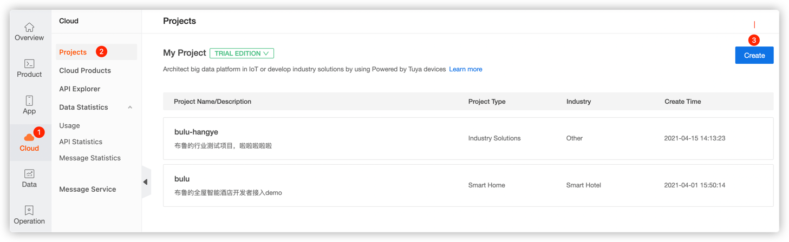
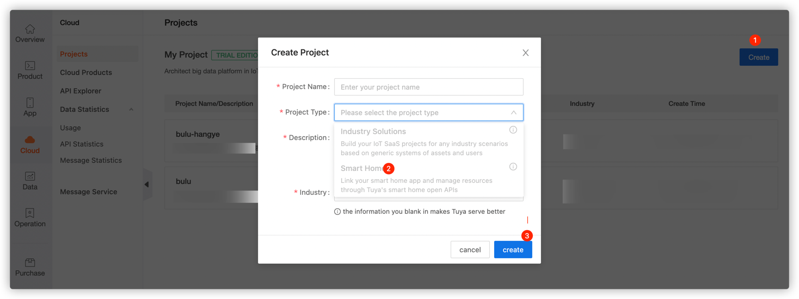
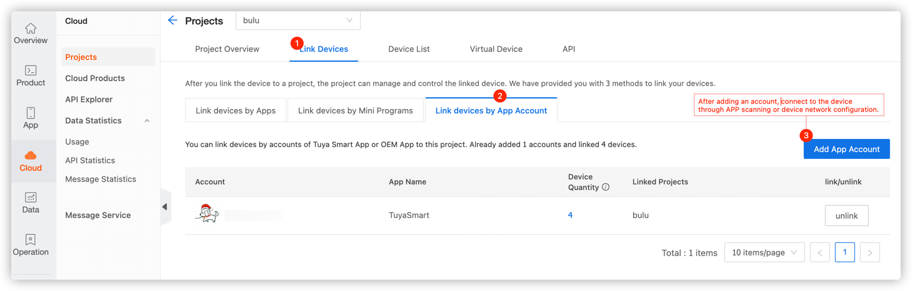
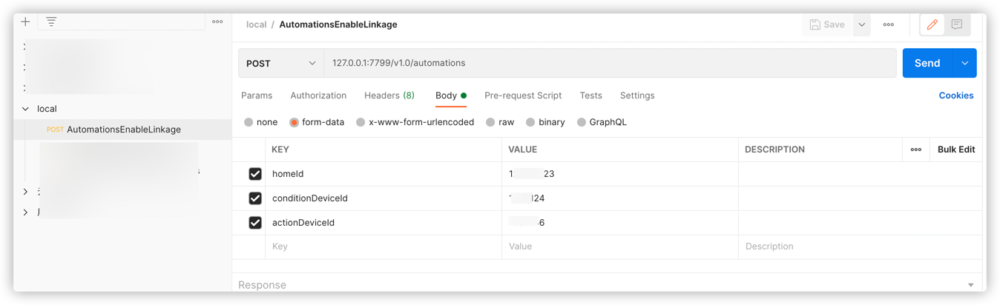

## Tuya Cloud Development: Devices Scene Linkage Sample

<p align="center">
    <a href="https://github.com/tuya/tuya-cloud-fingerbot-demo/commits/" title="Last Commit"></a>
    <a href="https://github.com/tuya/tuya-cloud-fingerbot-demo/blob/master/LICENSE" title="License"></a>
    <a href="https://github.com/tuya/tuya-cloud-fingerbot-demo/issues" title="Open Issues"></a>
</p>

[English](README.md)|[中文版](README_zh.md)

[comment]: <> (![]&#40;img/fingerbot-demo.gif&#41;)

Recently, I have the opportunity to get a set of smart devices to experience the charm of scene linkage. Just imagine, when you arrive home, the lights are automatically turned on, the stereo is playing your favorite songs, and the air conditioner is blowing a comfortable wind. When you go out, the lights, stereo, and air conditioner are automatically turned off. How comfortable and enjoyable this life is!

What is the power behind such a powerful scene linkage capability?

It is the [Tuya Cloud Development Platform](https://iot.tuya.com/cloud/), an IoT cloud open platform created by Tuya. It provides various cloud services including OpenAPI for application developers, device manufacturers, and solution providers in various industries, covering general capabilities for core scenarios such as device control, smart home management, and scene automation.

To implement the scene linkage capability among devices, authorize and call cloud APIs, and open the device status listening capability through the message queue to meet the partners' requirement of the device status listening.

### Security

- Certification security:
    - Tuya's message push system is deeply customized for identity authentication to meet high security requirements. Tuya uses a dynamic token mechanism to enhance security. Developers can ignore implementation details and complete authentication based on the SDK provided by Tuya.
- Data Security:
    - Transmission security: Tuya's Message Push System transmits data based on SSL.
    - Business security: Business data is encrypted with AES-128, and all requests are signed.

### Request method

- `username`: Enter the **Access ID** of the Authorization Key generated on the [Tuya Cloud Development Platform](https://iot.tuya.com/cloud/).
- `password`: Enter the **Access Secret** of the Authorization Key generated on the [Tuya Cloud Development Platform](https://iot.tuya.com/cloud/).
- `url`: Choose the endpoint that is closest to your location.
    - China: `https://openapi.tuyacn.com`
    - America: `https://openapi.tuyaus.com`
    - Europe: `https://openapi.tuyaeu.com`
    - India: `https://openapi.tuyain.com`

### Procedure

1. Log in to the [Tuya IoT Platform](https://iot.tuya.com/) and click **Cloud**.
   
2. Click **Create** to create a smart home project.
   
3. Click the created project to enter the details page. In the **Link Devices** tab, you can link the devices that are required by scene linkage.
   

## Features

- Support multiple types of conditions: device status conditions, external conditions, weather conditions, and timing conditions.

- Support multi-device and multi-command linkage: You can specify the lighting brightness, the stereo volume, and much more.

### Scene linkage creation event

```
{
    "conditions":[
        {
            "display":{
                "code":"presence_state",
                "operator":"==",
                "value":"presence"
            },
            "entity_id":"6cdad3c725*******",
            "entity_type":1,
            "order_num":1
        }
    ],
    "actions":[
        {
            "action_executor":"dpIssue",
            "entity_id":"1011201084f*******",
            "executor_property":{
                "switch":true
            }
        }
    ],
    "background":"https://images.tuyacn.com/smart/rule/cover/bedroom.png",
    "match_type":1,
    "name":"Scene automation"
}
```

### Scene linkage start event

```aidl
PUT /v1.0/homes/{home_id}/automations/{automation_id}/actions/enable
```

### Other events

| Event       | Description                         |
| :------------ | :---------------------------------- |
| Modify scene automation | Modify home automation configuration |
| Delete scene automation | Delete home automation configuration |
| Get the linkage conditions supported by the device | Get the linkage conditions or standard data points of the actions by device ID |
| Query weather conditions supported by automation scenes | Query weather conditions supported by automation |                   |

## Quick start

### Set `application.properties`

```yml
server.port=7799

# Basic configuration
tuya.cloud.base.domain=https://openapi.tuyacn.com
#tuya.cloud.base.domain=https://openapi.tuyaus.com
#tuya.cloud.base.domain=https://openapi.tuyaeu.com
#tuya.cloud.base.domain=https://openapi.tuyain.com
tuya.cloud.base.client-id=w34uc9su*******
tuya.cloud.base.secret=e592e7879e564*******

# token configuration
tuya.cloud.token.token-uri=/v1.0/token
# Automation configuration
tuya.cloud.auto.home-id=3170***
tuya.cloud.auto.add-uri=/v1.0/homes/%s/automations
tuya.cloud.auto.enable-uri=/v1.0/homes/%s/automations/%s/actions/enable
tuya.cloud.auto.delete-uri=/v1.0/homes/%s/automations/%s
```

### Start the project

Use **com.tuya.cloud.TuyaCloudControllingDeviceDemoApplication** to start the project.

### Try it out

You can use Postman to try it out.



## Issue feedback

You can provide feedback on your issue in **Github Issue** or [submit a ticket](https://service.console.tuya.com/).

## License

Tuya Android Home SDK Sample is available under the MIT license. For more information, see [License](https://github.com/tuya/tuya-cloud-controlling-device-demo/blob/master/LICENSE).

