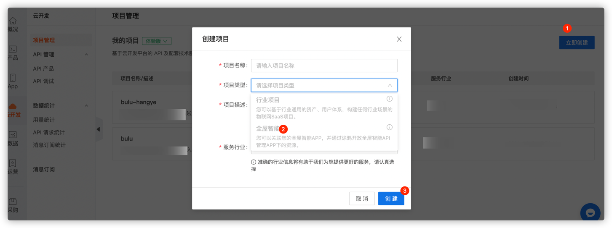
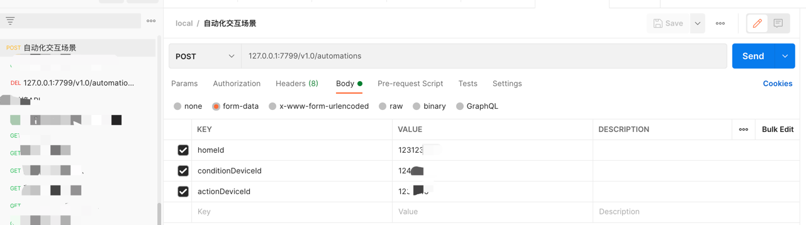

## Tuya Development Cloud—Devices Scene linkage Sample

<p align="center">
    <a href="https://github.com/tuya/tuya-cloud-fingerbot-demo/commits/" title="Last Commit"></a>
    <a href="https://github.com/tuya/tuya-cloud-fingerbot-demo/blob/master/LICENSE" title="License"></a>
    <a href="https://github.com/tuya/tuya-cloud-fingerbot-demo/issues" title="Open Issues"></a>
</p>

[English](README.md)|[中文版](README_zh.md)

[comment]: <> (![]&#40;img/fingerbot-demo.gif&#41;)

Recently I have the opportunity to get a set of smart devices to experience the charm of scene linkage. Imagine: when
you arrive home, the lights are automatically turned on, the stereo is playing your favorite songs, and the air
conditioner is blowing a comfortable wind; when you go out, the lights, stereo, and air conditioner are automatically
turned off; how comfortable and enjoyable this life is .

What is the power behind such a powerful scene linkage ability?

It is the Tuya cloud development platform. The cloud development platform is an IoT cloud open platform created by Tuya.
It provides various cloud services including OpenAPI for application developers, device manufacturers, and solution
providers in various industries, covering device control, General capabilities for core scenarios such as whole house
management and scene automation.

The scene linkage capability is mainly used for authorization calls in the form of cloud APIs, and the device status
monitoring capability is opened through the message queue to meet the monitoring of the device status by partners, and
is used to realize the linkage between different devices.

### Security

- Certification security:
    - Tuya Smart's message push system is deeply customized for identity authentication to meet high security
      requirements. Tuya Smart uses a dynamic token mechanism to enhance security. Developers can ignore implementation
      details and complete authentication based on the SDK provided by Tuya Smart.
- Data Security:
    - Transmission security: Tuya Smart Message Push System transmits data based on SSL.
    - Business security: Business data is encrypted with AES-128, and all requests are signed.

### Request method

- username: Enter the **Access ID** of the Authorization Key generated in the Cloud Development.
- password: Enter the **Access Secret** of the Authorization Key generated in the Cloud Development.
- url: Choose the endpoint that is closest to your location.
    - China: `https://openapi.tuyacn.com`
    - America: `https://openapi.tuyaus.com`
    - Europe: `https://openapi.tuyaeu.com`
    - India: `https://openapi.tuyain.com`

### Procedure

1. Log in to the [Cloud Development module on the Tuya IoT Platform](https://iot.tuya.com/cloud/).
   
2. Create a whole house smart project.
   
3. In the **Associated Device** module in the project, a set of devices linked to the scene is associated.
   

## Features

Support multiple types of conditions:

- equipment status conditions, external conditions, weather conditions, timing conditions;

Support multi-device and multi-command linkage:

- you can specify the brightness of the light, the size of the sound, etc.;

### Scene linkage creation event

```
{
    "conditions":[
        {
            "display":{
                "code":"presence_state",
                "operator":"==",
                "value":"presence"
            },
            "entity_id":"6cdad3c725*******",
            "entity_type":1,
            "order_num":1
        }
    ],
    "actions":[
        {
            "action_executor":"dpIssue",
            "entity_id":"1011201084f*******",
            "executor_property":{
                "switch":true
            }
        }
    ],
    "background":"https://images.tuyacn.com/smart/rule/cover/bedroom.png",
    "match_type":1,
    "name":"布鲁-场景自动化"
}
```

### Scene linkage start event

```aidl
PUT /v1.0/homes/{home_id}/automations/{automation_id}/actions/enable
```

### Other events

| Event       | Description                         |
| :------------ | :---------------------------------- |
| Modify scene automation | Modify home automation configuration |
| Delete scene automation | Delete home automation configuration |
| Obtain the linkage conditions supported by the device | Obtain the linkage conditions or perform the standard function points of the action according to the device ID |
| Query weather conditions supported by automation scenarios | Query weather conditions supported by automation |                   |

## Quick start

### Set application properties

```yml
server.port=7799

# Basic configuration
tuya.cloud.base.domain=https://openapi.tuyacn.com
#tuya.cloud.base.domain=https://openapi.tuyaus.com
#tuya.cloud.base.domain=https://openapi.tuyaeu.com
#tuya.cloud.base.domain=https://openapi.tuyain.com
tuya.cloud.base.client-id=w34uc9su*******
tuya.cloud.base.secret=e592e7879e564*******

# token configuration
tuya.cloud.token.token-uri=/v1.0/token
# Automated configuration
tuya.cloud.auto.home-id=3170***
tuya.cloud.auto.add-uri=/v1.0/homes/%s/automations
tuya.cloud.auto.enable-uri=/v1.0/homes/%s/automations/%s/actions/enable
tuya.cloud.auto.delete-uri=/v1.0/homes/%s/automations/%s
```

### Start the project

Use **com.tuya.cloud.TuyaCloudControllingDeviceDemoApplication** to start the project.

### Experience use
One-click request using postman


## Issue feedback

You can provide feedback on your issue in **Github Issue** or [submit a ticket](https://service.console.tuya.com/).

## License

Tuya Android Home SDK Sample is available under the MIT license. For more information,
see [License](https://github.com/tuya/tuya-cloud-controlling-device-demo/blob/master/LICENSE).

