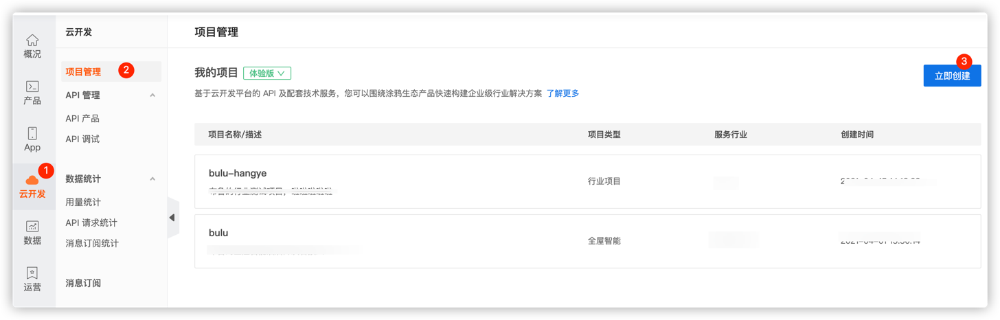
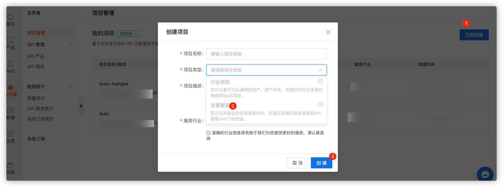
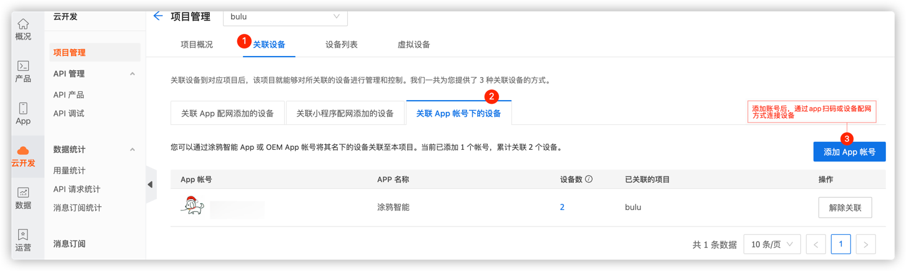

## Tuya Development Cloud—Devices Scene linkage Sample

<p align="center">
    <a href="https://github.com/tuya/tuya-cloud-fingerbot-demo/commits/" title="Last Commit"></a>
    <a href="https://github.com/tuya/tuya-cloud-fingerbot-demo/blob/master/LICENSE" title="License"></a>
    <a href="https://github.com/tuya/tuya-cloud-fingerbot-demo/issues" title="Open Issues"></a>
</p>

[中文版](README_zh.md) | [English](README.md)

[comment]: <> (![]&#40;img/enableLinkage-demo.gif&#41;)

最近有机会拿到了一套智能设备，体验一下场景联动的魅力。想象一下：当你一到家，灯自动打开，音响播放着你喜爱的歌曲，空调吹着舒适的风；当你一出门，灯、音响、空调都自动关闭；这样的生活是多么惬意，多么享受。

如此强大的场景联动能力, 它背后的力量是什么呢?

它就是涂鸦云开发平台，云开发平台是涂鸦打造的物联网云端开放平台，为各行业应用开发者、设备制造商、方案商提供了包含 OpenAPI 在内的各类云端服务，覆盖了设备控制、全屋管理、场景自动化等核心场景的通用能力。

场景联动能力主要以云端 API 的方式进行授权调用，通过消息队列的方式开放设备状态监听能力，以满足合作伙伴对设备状态的监听，用于实现不同设备间的联动。

### 安全

- 认证安全：
  涂鸦智能 消息推送系统针对身份认证进行了深度定制以满足高安全性要求，涂鸦智能采用动态令牌机制增强安全，开发者可忽略实现细节，基于涂鸦智能提供的 SDK 完成认证。
- 数据安全：
  传输安全：涂鸦智能消息推送系统基于 SSL 传输数据。
  业务安全：业务数据均采用 AES-128 加密，请求均附上签名。


### 请求方式

- username：填写云开发平台中 API 授权密钥的 **Access ID**。
- password：填写云开发平台中 API 授权密钥的 **Access Secret**。
- url：根据调用的区域进行选择。
  - 中国区：`https://openapi.tuyacn.com`
  - 美国区：`https://openapi.tuyaus.com`
  - 欧洲区：`https://openapi.tuyaeu.com`
  - 印度区：`https://openapi.tuyain.com`

### 开通方式

1. 登录 **[IoT 工作台](https://iot.tuya.com/) > 云开发**。
   
2. 创建全屋智能项目。
   
3. 在项目中的**关联设备**模块，关联场景联动的一套设备。
   


## 特色

支持多类条件：设备状态条件、外部条件、天气条件、定时条件；
支持多设备多指令联动：可指定灯开启亮度，音响声音大小等；

### 场景联动创建事件

```
{
    "conditions":[
        {
            "display":{
                "code":"presence_state",
                "operator":"==",
                "value":"presence"
            },
            "entity_id":"6cdad3c725*******",
            "entity_type":1,
            "order_num":1
        }
    ],
    "actions":[
        {
            "action_executor":"dpIssue",
            "entity_id":"1011201084f*******",
            "executor_property":{
                "switch":true
            }
        }
    ],
    "background":"https://images.tuyacn.com/smart/rule/cover/bedroom.png",
    "match_type":1,
    "name":"布鲁-场景自动化"
}
```
### 场景联动启动事件

```aidl
PUT /v1.0/homes/{home_id}/automations/{automation_id}/actions/enable
```


### 其他事件

| 事件       | 描述               |
| :------------ | :----------------- |
| 修改场景自动化 | 修改家庭的自动化配置 |
| 删除场景自动化 | 删除家庭的自动化配置 |
| 获取设备支持的联动条件        | 根据设备 ID 获取联动条件或执行动作的标准功能点          |
| 查询自动化场景支持的天气条件     | 查询自动化支持的天气条件           |


## 快速入门

### 设置application.properties

```yml
server.port=7799

# 基础配置
tuya.cloud.base.domain=https://openapi.tuyacn.com
#tuya.cloud.base.domain=https://openapi.tuyaus.com
#tuya.cloud.base.domain=https://openapi.tuyaeu.com
#tuya.cloud.base.domain=https://openapi.tuyain.com
tuya.cloud.base.client-id=w34uc9su*******
tuya.cloud.base.secret=e592e7879e564*******

# token配置
tuya.cloud.token.token-uri=/v1.0/token
# 自动化配置
tuya.cloud.auto.home-id=3170***
tuya.cloud.auto.add-uri=/v1.0/homes/%s/automations
tuya.cloud.auto.enable-uri=/v1.0/homes/%s/automations/%s/actions/enable
tuya.cloud.auto.delete-uri=/v1.0/homes/%s/automations/%s
```


### 启动工程

使用**com.tuya.cloud.TuyaCloudControllingDeviceDemoApplication**这个类启动工程。

### 体验使用
使用postman一键请求


问题反馈
---

您可以通过**Github Issue** 或通过[**工单**](https://service.console.tuya.com)来进行反馈您所碰到的问题


LICENSE
---

Tuya Android Home SDK Sample是在MIT许可下提供的。更多信息请参考[LICENSE](https://github.com/tuya/tuya-cloud-fingerbot-demo/blob/master/LICENSE)文件